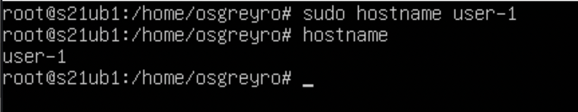
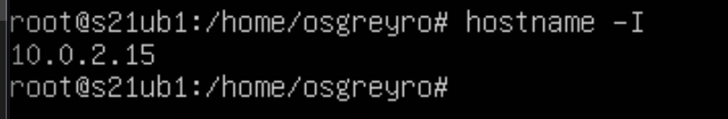
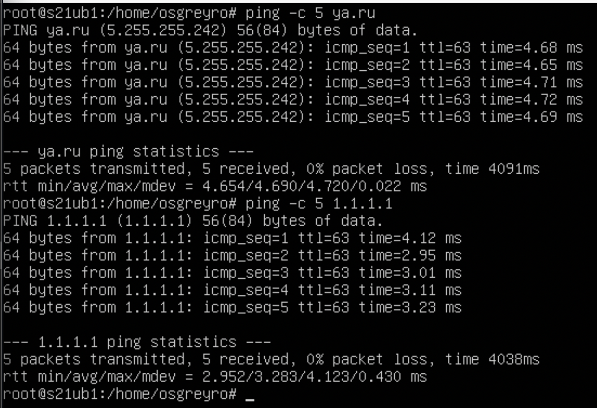
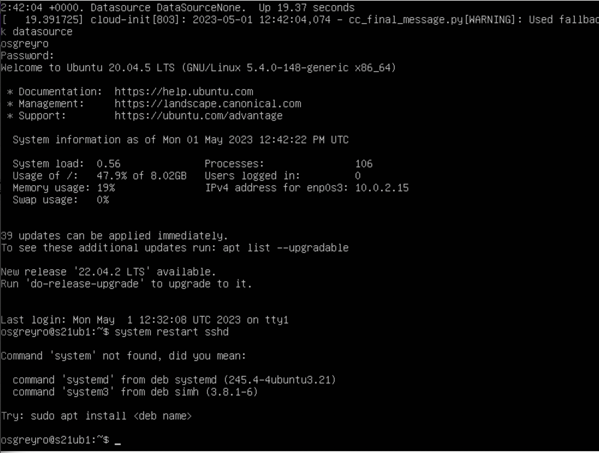

## **Part 1. Установка ОС**
***
* **Узнайте версию Ubuntu, выполнив команду `cat /etc/issue`.**
    + 
## **Part 2. Создание пользователя**
***
* **Создание нового пользователя.**
    + 
* **Вывод команды `cat /etc/passwd`.**
    +  
## **Part 3. Настройка сети OC**
***
* **Установить название машины вида user-1.**
    + 
* **Установить временную зону, соответсвующую моему текущему местположению.**
    + 
* **Вывести название сетевых интерфейсов с помощью консольной команды.**
    + 
    + _lo- loopback, локальная петля, нужна для подключения к сети этой же_ машины, не требует дополнительных настроек
* **Используя консольную команду получить ip адрес устройства, на котором вы работаете, от DHCP сервера.**
    + 
    + _DHCP (Dynamic Host Configuration Protocol ) - это протокол прикладного уровня, который помогает назначать IP-адреса устройствам при подключении к серверу_
* **Определить и вывести на экран внешний ip-адрес шлюза (ip) и внутренний IP-адрес шлюза, он же ip-адрес по умолчанию (gw).**
    + _Вненший ip-адрес_ 
    + _Внетренний ip-адрес_ 
    + _Задать статичные настройки ip, gw, dns_
        - _Открываем_
          
          _Было_
          
          _Стало_
          
        - _Применяем_
          
        - _Перезагружаем и проверяем_
          
        - _Пингуем_
          
## **Part4. Обновление OC**
***
* **Нужно обновить системные пакеты**
    + _Обновляем_
      
## **Part5. Использование**
***
* **Разрешить пользователю использовать sudo и от его имени изменить hostname**
    + 
      _sudo - Substitute User and do, дословно «подменить пользователя и выполнить»_
## **Part 6. Установка и настройка службы времени**
***
* **Вывести время, часового пояса, в котором вы сейчас находитесь.**
    + 
## **Part7. Установка и использование текстовых редакторов**
***
*  _Устанавливаем текстовые редакторы_
    + _Vim Nano Joe_
* _Создаем текстовые файлы_
    + `esc lshift+: wq`
    
    + `ctrl+k x`
    + `ctrl+x y`
* _Редактируем и закрываем без изменений_
    + `esc lshift+: !q` 
    + `ctrl+c y` 
    + `ctrl+x n` 
* _Редактируем и осваиваем поиск_
    + _Vim - :s/искомое слово/ слово на которое заменяем_
    
    
    + _Joe - Control+K-F  искомое слово R слово на которое заменяем далее Y_
    
    
    * _Nano - Ctrl+\ искомое слово Enter слово на которое заменяем Enter далее Y_
    
    

## **Part8. Установка и базовая настройка сервиса SSHD**
***
* _Устанавливаем SSHD_
    + `sudo apt install openssh-server`
      
    + _Перенастраиваем на 2022 порт_
      
      
        _ps (показывает запущенные процессы, выполняемые пользователем в окне терминала); ps -e или ps -A (Чтобы просмотреть все запущенные процессы); ps -d (Чтобы показать все процессы, кроме лидеров сессии); ps -d -N (можно инвертировать вывод с помощью переключателя -N. Например, если хочу вывести только лидеров сеансов) ps T (увидеть только процессы, связанные с этим терминалом); ps r (просмотреть все работающие (running) процессы); ps -p 'pid' (если вы знаете идентификатор процесса PID, вы можете просто использовать следующую команду, для вывода процесса с этим 'pid'); ps -p 'pid1' 'pid2' ps U 'userlist' (найти все процессы, выполняемые конкретным пользователем); ps -ef (получить полный список);_ 
    + _Перезагружаем_
    + _Перезапускаем_
    + _Выводим `netstat -tan`_
    + _-t (--tcp) отображает соедниеня только по tcp -a (--all) вывод всех активных подключений TCP -n (--numeric) вывод активных подключений TCP с отображением адресов и номеров портов в числовом формате. Proto: Название протокола (протокол TCP или протокол UDP); recv-Q: очередь получения сети;_
## **Part 9. Установка и использование утилит top, htop**
***
* _uptime: 19 min_\
_Кол-во автор. пол-ей: 1_\
_Общая загрузка системы: 0.0, 0.1, 0.0_\
_Общее количество процессов: 93_\
_загрузка cpu: 0.3_\
_загрузку памяти: 145.4/362.2_\
_pid процесса занимающего больше всего памяти 643_
_pid процесса, занимающего больше всего процессорного времени 545_
 
* _Сортировка:_
    + _по PID_ 
    + _по PERCENT_CPU_
    + _по PERCENT_MEM_
    + _по TIME_
* _Фильтрация для процесса sshd_
* _syslog через поиск_
* _Добавленный вывод (hostname, clock и uptime)_
## **Part 10. Использование утилиты fdisk**
***
* _Название: VBOX HARDDISK_\
  _Размер: 8.25gb_\
  _Кол-во секторов: 17 293 312_\
  _swap: 1 531 900_
  
  
## **Part 11. Использование утилиты df**
***
* Запустить команду df:

_Размер раздела: 8 408 452_\
_Размер занятого пространства: 4 027 020_\
_Процент использования 51%_\
_Единица измерения в выводе:1K_
* Запустить команду df -Th:

_Размер раздела: 8.1gb_\
_Размер занятого пространства: 3.9gb _\
_Размер свободного пространства: 3.8gb_\
_Процент использования: 51%_\
_Тип файловой системы для раздела: ext4_
## **Part 12. Использование утилиты du**
***
* 
* 
* 

## **Part 13. Установка и использование утилиты ncdu**
***

* 
* 
* 
* 

## **Part 14. Работа с системными журналами**
***
* _/var/log/dmesg_
* _/var/log/syslog_
* _/var/log/auth.log_
* _13:46:10_
* _Перезапуск SSHd_
## **Part 15. Использование планировщика заданий CRON**
***
* _Добавляем задание_
* _Две строчки в заданном диапазоне_
* _Список заданий CRON_
* _Удаляем все задания хрон_